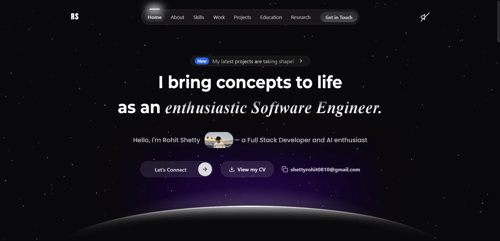

# Personal Portfolio Website



A modern, responsive portfolio website built with React and Tailwind CSS, featuring a dark theme, smooth animations, and interactive components.

## 🌟 Features

- **Modern UI/UX**: Clean and professional design with smooth transitions
- **Responsive Design**: Fully responsive across all devices
- **Dark Theme**: Optimized for comfortable viewing
- **Interactive Components**: Dynamic project cards and skill sections
- **Contact Form**: Integrated EmailJS for direct communication
- **Performance Optimized**: Fast loading with optimized assets
- **Animations**: Smooth scroll effects and hover animations

## 🛠️ Built With

- React.js
- Tailwind CSS
- EmailJS
- Framer Motion
- Particle.js
- CSS3 Animations

## 🚀 Projects Showcased

1. **ATS Optimizer**: AI-powered resume analyzer
2. **Art Explorer Web**: Angular-based art discovery platform
3. **Brain Stroke Prediction**: DNN-based medical prediction system
4. **Android Art Explorer**: Native Android art exploration app
5. **Melody Generation**: AI music generation using RNN-LSTM
6. **Personal Portfolio**: This website

## 🔧 Installation & Setup

1. Clone the repository:
   ```bash
   git clone https://github.com/shettyrohit0810/Personal-Portfolio.git
   ```

2. Navigate to the project directory:
   ```bash
   cd portfolio-website
   ```

3. Install dependencies:
   ```bash
   npm install
   ```

4. Start the development server:
   ```bash
   npm start
   ```

## 📱 Contact

Feel free to reach out to me through the contact form on the website or via:
- [LinkedIn](https://www.linkedin.com/in/rohit-ramesh-shetty/)
- [GitHub](https://github.com/shettyrohit0810)

## 🌐 Live Demo

Visit the live website: [https://rohit-ramesh-shetty.netlify.app/](https://rohit-ramesh-shetty.netlify.app/)

## 📄 License

This project is open source and available under the MIT License.